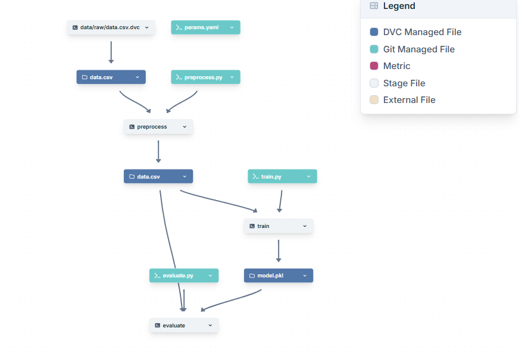

# ML Pipeline with DVC, MLflow, Git, and DagsHub

This project demonstrates an end-to-end **Machine Learning pipeline** using:

- **DVC** for data and pipeline versioning
- **MLflow** for experiment tracking
- **Git** for code versioning
- **DagsHub** for remote storage and collaboration

The project follows a reproducible ML workflow consisting of:

1. **Data Preprocessing**
2. **Model Training**
3. **Model Evaluation**

---

# Project Structure

```text
ML_PIPELINE_02/
│── .dvc/
│
│── data/
│   ├── raw/
│   │   ├── data.csv.dvc
│   │   └── .gitignore
│   │
│   └── processed/
│       ├── data.csv
│       └── .gitignore
│
│── models/
│
│── reports/
│   └── metrics.json
│
│── src/
│   ├── __init__.py
│   ├── preprocess.py
│   ├── train.py
│   └── evaluate.py
│
│── dvc.yaml
│── dvc.lock
│── params.yaml
│── requirements.txt
│── README.md
```

---

# Pipeline Workflow

The ML pipeline follows this sequence:

```text
Raw Data
    ↓
Preprocessing
    ↓
Processed Data
    ↓
Training
    ↓
Trained Model
    ↓
Evaluation
    ↓
Metrics
```

## DVC Pipeline DAG



---

# Technologies Used

- Python
- DVC
- MLflow
- DagsHub
- Scikit-learn
- Pandas
- NumPy
- Git

---

# Pipeline Stages

## 1. Preprocessing Stage

This stage:

- Loads raw dataset
- Cleans and preprocesses data
- Saves processed dataset

Command:

```bash
python src/preprocess.py
```

DVC Stage:

```bash
dvc stage add -n preprocess \
-d src/preprocess.py \
-d data/raw/data.csv \
-p preprocess \
-o data/processed/data.csv \
python src/preprocess.py
```

---

## 2. Training Stage

This stage:

- Loads processed data
- Trains ML model
- Saves trained model

Command:

```bash
python src/train.py
```

DVC Stage:

```bash
dvc stage add -n train \
-d src/train.py \
-d data/processed/data.csv \
-p train \
-o models/model.pkl \
python src/train.py
```

---

## 3. Evaluation Stage

This stage:

- Loads trained model
- Evaluates model performance
- Generates evaluation metrics

Command:

```bash
python src/evaluate.py
```

DVC Stage:

```bash
dvc stage add -n evaluate \
-d src/evaluate.py \
-d models/model.pkl \
-d data/processed/data.csv \
-M reports/metrics.json \
python src/evaluate.py
```

---

# Running the Pipeline

To reproduce the complete pipeline:

```bash
dvc repro
```

DVC automatically executes only the stages affected by changes.

Example:

- If raw data changes → entire pipeline reruns
- If training code changes → only training + evaluation rerun
- If evaluation changes → only evaluation reruns

---

# DVC Commands Used

## Initialize DVC

```bash
dvc init
```

## Add Dataset to DVC

```bash
dvc add data/raw/data.csv
```

## Reproduce Pipeline

```bash
dvc repro
```

## Push Data to Remote Storage

```bash
dvc push
```

## Pull Data from Remote Storage

```bash
dvc pull
```

## View Pipeline DAG

```bash
dvc dag
```

---

# Installation

Clone repository:

```bash
git clone https://github.com/Vijay-Junoon/End-to-end-ML-Project_02/edit/main
cd End-to-end-ML-Project_02
```

Install dependencies:

```bash
pip install -r requirements.txt
```

Pull DVC tracked data:

```bash
dvc pull
```

Run pipeline:

```bash
dvc repro
```

---

# Key Features

- Reproducible ML pipeline
- Automated dependency tracking
- Dataset versioning with DVC
- Model versioning
- Experiment tracking with MLflow
- Remote storage using DagsHub
- Git-integrated workflow

---

# Future Improvements

- Hyperparameter tuning
- CI/CD integration
- Docker containerization
- Model deployment
- Automated retraining pipeline

---

# Author

**V Vijay**
